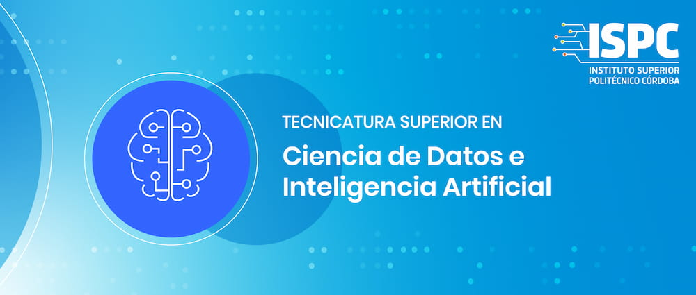

# Nombre del grupo: C1006
Repositorio para presentar el trabajo integrador final
## Integrantes:
* Mercado, Isaac Pablo Ruben

## Descripcion del proyecto
----------
El presente proyecto tiene como principal objetivo, generar un scraping web del portal de noticia de Página12, que recorra cada una de las secciones y vaya guardando los datos en una tabla con las siguientes variables.
* el titulo
* la volanta
* el copete
* el cuerpo
* el autor
* la fecha de publicacion

La segunda parte del proyecto tiene que ver con un análisis semántico del contenido extraído, en el cual se cuentan la cantidad de palabras que se repiten y a partir de ello generar una nube de palabras.

Las tecnologías con las que trabajamos fue principalmente whatapp para comunicarnos, trello para organizarnos, utilizamos python para realizar el scraping a partir del uso de la librería requets para conectarse con la web, y BeautifulSoup4 para extraer la información del html.
Asimismo, utilizamos github para crear el repositorio y poder trabajar en conjunto con el proyecto.
